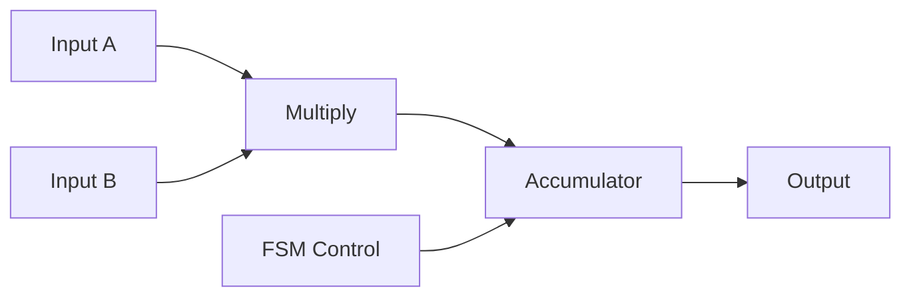
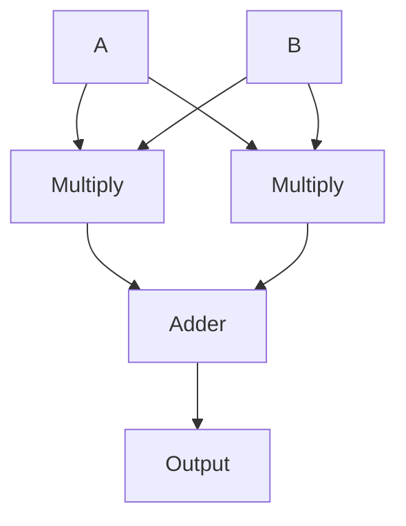
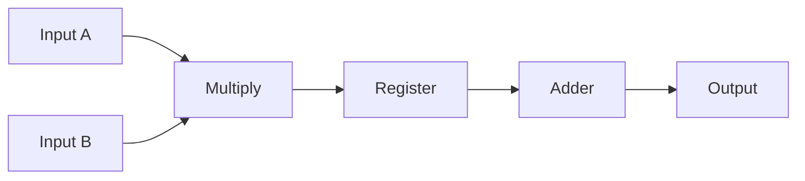

# 🧮 Matrix Multiplier Architectures (VLSI Design)

[]()
[]()
[]()
[]()

> 🚀 High-performance hardware implementations of matrix multiplication using Serial, Parallel, and Pipelined architectures

---

## 📋 Project Overview

This project implements and compares three fundamental VLSI architectures for matrix multiplication using **Verilog HDL**.

### ✨ Highlights
- 🔁 Three architectures implemented from scratch  
- 📊 Full comparison: Area, Power, Timing  
- ⚡ Synthesized using Cadence Genus  
- 🧱 Physical layouts using Innovus  
- 📈 Scalable design (2×2, 3×3, 4×4)  

---

## 🧠 Problem Statement

Matrix multiplication is a core operation in:
- AI accelerators 🤖  
- DSP systems 📡  
- Graphics & vision 🎥  

The challenge is optimizing:
> ⚖️ **Speed vs Area vs Power**

---

## 🎞️ Architecture Flow (Visual)

### 🔁 Serial Architecture


### ⚡ Parallel Architecture


### 🚀 Pipelined Architecture


---

## 🧠 Architecture Explanation

### 🔁 Serial
- Single MAC unit  
- Sequential computation  
- Low area, high latency  

### ⚡ Parallel
- All operations in parallel  
- Fastest execution  
- High area & power  

### 🚀 Pipelined
- Staged computation  
- Balanced design  
- Improved throughput  

---

## 📊 Performance Comparison

| Metric | Serial | Parallel | Pipelined |
|--------|--------|----------|------------|
| Multipliers | 1 | N³ | N² |
| Latency | High | Very Low | Medium |
| Area | Low | High | Medium |
| Power | Low | High | Medium |

---

## 📊 Results


---

## 🧩 Architecture Diagrams


---

## 🛠️ Tech Stack

- Verilog HDL  
- Cadence Genus  
- Cadence Innovus  
- NC Launch  

---

## 📁 Project Structure

```
matrix-multiplier-vlsi/
├── serial.v
├── parallel.v
├── pipelined.v
├── docs/
└── README.md
```

---

## 🎯 Applications

- AI accelerators  
- Signal processing  
- Image processing  
- Scientific computing  

---

## 💡 Key Insights

✔ Serial → Efficient but slow  
✔ Parallel → Fast but expensive  
✔ Pipelined → Best trade-off  

---

## 👨‍💻 Authors

- Siddhant Singh  
- Sai Akhilash  
- Anshika Gupta  
- Laveesh M Suvarna  

---

## ⭐ If you like this project

Give it a ⭐ and share it!
