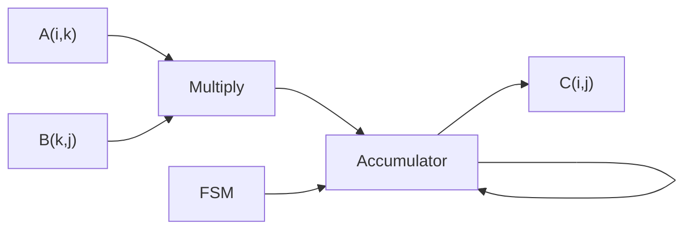
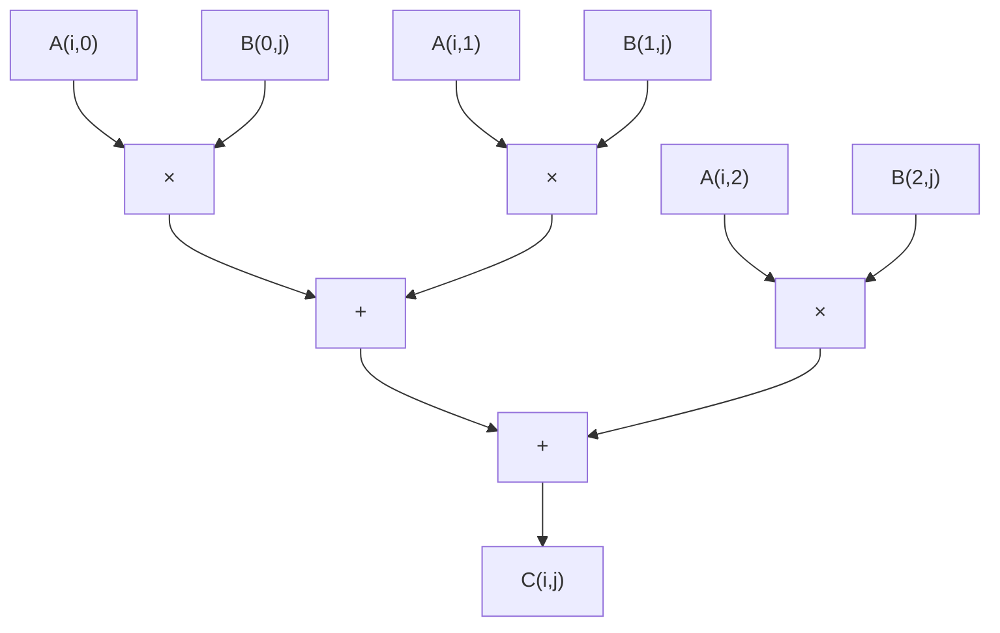
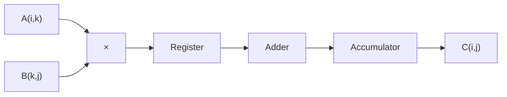
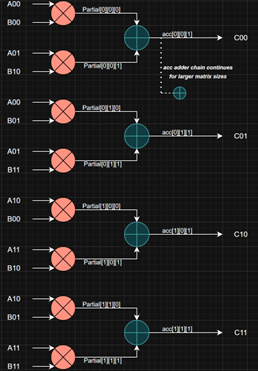
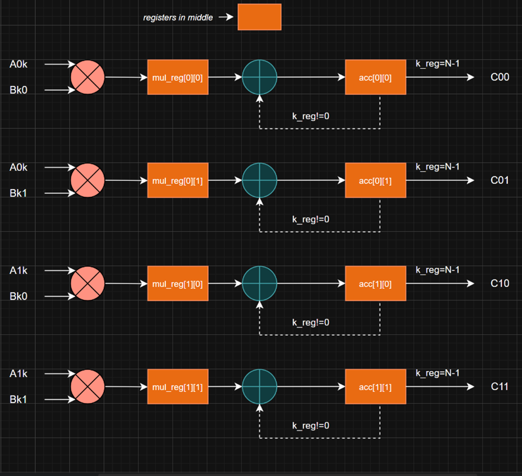
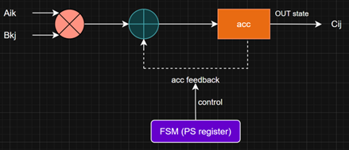
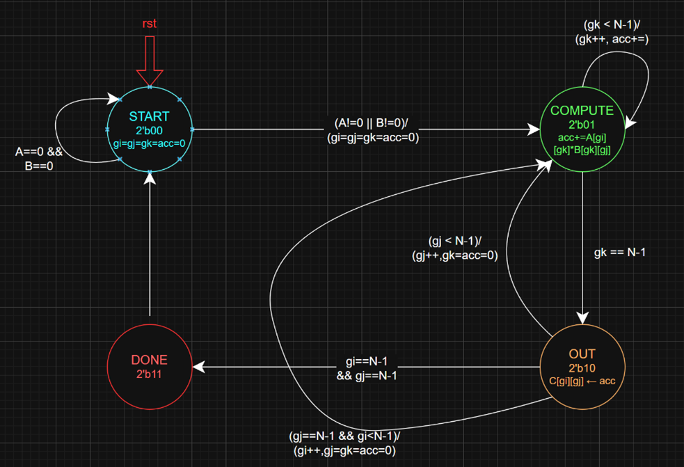
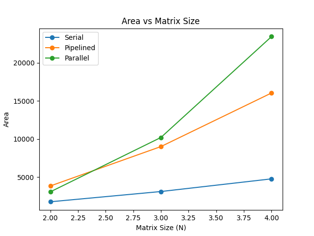
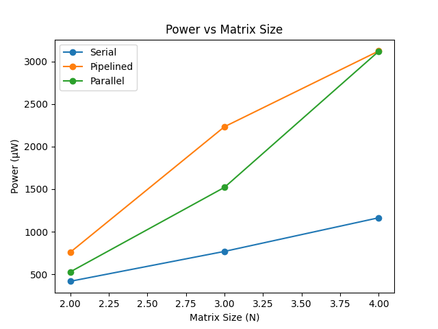
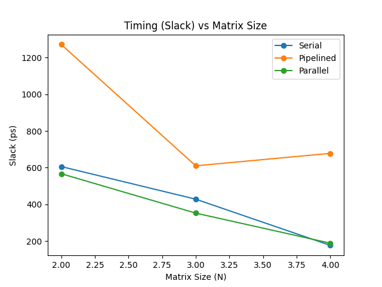

# 🧮 Matrix Multiplier Architectures (VLSI Design)

[]()
[]()
[]()

> 🚀 High-performance hardware implementations of matrix multiplication using Serial, Parallel, and Pipelined architectures

---

## 📋 Project Overview

This project implements and compares three fundamental VLSI architectures for matrix multiplication using **Verilog HDL**.

### ✨ Highlights

* 🔁 Three architectures implemented from scratch
* 📊 Full comparison: Area, Power, Timing
* ⚡ Synthesized using Cadence Genus
* 🧱 Physical layouts using Innovus
* 📈 Scalable design (2×2, 3×3, 4×4)

---

## 🧠 Problem Statement

Matrix multiplication is a core operation in:

* AI accelerators 🤖
* DSP systems 📡
* Graphics & vision 🎥

The challenge is optimizing:

> ⚖️ **Speed vs Area vs Power**

---

## 🎞️ Flowcharts (Mermaid)

### 🔁 Serial Architecture (FSM + MAC)



### ⚡ Parallel Architecture (Fully Combinational)



### 🚀 Pipelined Architecture (Stage-wise)



---

## 🧠 Architecture Explanations

### 🔁 Serial Architecture — Step-by-Step

1. FSM initializes indices (i, j, k) and accumulator.
2. Each cycle computes: `acc = acc + A(i,k) × B(k,j)`.
3. When k reaches N-1, result is written to `C(i,j)`.
4. j increments; after full row, i increments.
5. Process repeats until all N² outputs are computed.

**Key Idea:** Single MAC reused → lowest area, highest latency.

---

### ⚡ Parallel Architecture — Step-by-Step

1. For each output `C(i,j)`, all `A(i,k) × B(k,j)` are computed **simultaneously**.
2. Partial products flow through an **adder chain**.
3. Final sum is available in one clock cycle (after register).

**Key Idea:** Massive parallelism → fastest, but very high area/power.

---

### 🚀 Pipelined Architecture — Step-by-Step

1. **Cycle k=0:** Compute `A(i,0)×B(0,j)` → store in `mul_reg`, initialize `acc`.
2. **Cycle k=1..N-2:** Compute next product; previous value moves from `mul_reg` to `acc` and accumulates.
3. **Cycle k=N-1:** Final accumulation completes; write `C(i,j)`.
4. Reset accumulator for next output.

**Key Idea:** Overlaps multiplication and accumulation across cycles → balanced area with improved throughput (≈1 result every N cycles).

---

### ⚡ Key Insight

* Pipeline overlaps **multiplication and accumulation**
* Improves **throughput** (1 result every N cycles)
* Reduces critical path → better timingmermaid
  flowchart LR
  classDef mul fill:#ffcccb,stroke:#333;
  classDef reg fill:#ffe5cc,stroke:#333;
  classDef acc fill:#cce5ff,stroke:#333;

  A["A(i,k)"] --> M((×)):::mul
  B["B(k,j)"] --> M

  M --> R1["mul_reg"]:::reg
  R1 --> ADD((+)):::acc
  ADD --> ACC["acc"]:::acc

  ACC -->|k_reg == 0 (reset)| ACC
  ACC -->|k_reg != 0 (accumulate)| ACC

  ACC -->|k_reg == N-1| C["C(i,j)"]

```

---

Matrix multiplication is a core operation in:
- AI accelerators 🤖
- DSP systems 📡
- Graphics & vision 🎥

The challenge is optimizing:
> ⚖️ **Speed vs Area vs Power**

---

## 🏗️ Architectures Implemented

### 🔁 Serial Architecture
- Single MAC unit
- FSM-controlled
- 🟢 Lowest area & power
- 🔴 Highest latency

### ⚡ Parallel Architecture
- N³ multipliers
- Fully combinational
- 🟢 Fastest (1 cycle)
- 🔴 Highest area & power

### 🚀 Pipelined Architecture
- N² multipliers
- Staged computation
- 🟢 Best trade-off design

---

## 📊 Architecture Comparison

| Metric | Serial | Parallel | Pipelined |
|------|--------|----------|------------|
| Multipliers | 1 | N³ | N² |
| Latency | N³ + N² | 1 | N |
| Area | 🟢 Low | 🔴 High | 🟡 Medium |
| Power | 🟢 Low | 🔴 High | 🟡 Medium |

---

## 🧩 Architecture Diagrams

### ⚡ Parallel Architecture


---

### 🚀 Pipelined Architecture


---

### 🔁 Serial Architecture (Datapath)


---

### 🧠 FSM Control (Serial)


---

## 📊 Results

### 📈 Performance Plots (add images)

> Save these generated plots in `docs/` to visualize trends.

- Area vs Matrix Size → `docs/area_plot.png`
- Power vs Matrix Size → `docs/power_plot.png`
- Slack vs Matrix Size → `docs/timing_plot.png`

```md



````

---

### 📐 Area (Library Units)

### 📐 Area (Library Units)

| Architecture | 2×2  | 3×3   | 4×4   |
| ------------ | ---- | ----- | ----- |
| Serial       | 1780 | 3126  | 4787  |
| Pipelined    | 3854 | 9024  | 16055 |
| Parallel     | 3083 | 10218 | 23453 |

### ⚡ Power (µW)

| Architecture | 2×2 | 3×3  | 4×4  |
| ------------ | --- | ---- | ---- |
| Serial       | 418 | 769  | 1164 |
| Pipelined    | 758 | 2233 | 3122 |
| Parallel     | 528 | 1521 | 3119 |

### ⏱️ Timing

* ✅ All designs meet timing
* 🥇 Best: Pipelined
* ⚠️ Tightest: Serial (large N)

---

## 🛠️ Tech Stack

| Category        | Tools             |
| --------------- | ----------------- |
| HDL             | Verilog           |
| Simulation      | Cadence NC Launch |
| Synthesis       | Cadence Genus     |
| Physical Design | Cadence Innovus   |

---

## 🚀 How to Run

### Simulation

```bash
ncvlog *.v
ncsim testbench
```

### Synthesis

* Import RTL into **Cadence Genus**
* Apply constraints
* Generate reports

---

## 📁 Project Structure

```
matrix-multiplier-vlsi/
├── serial.v
├── parallel.v
├── pipelined.v
├── testbench/
├── docs/
├── reports/
└── README.md
---

---

## 🎯 Applications

* AI hardware accelerators
* Signal processing systems
* Image processing pipelines
* Scientific computing

---

## 💡 Key Insights

✔ Serial → Efficient but slow
✔ Parallel → Fast but expensive
✔ Pipelined → Best balance

---

## 👨‍💻 Authors

* Siddhant Singh
* Sai Akhilash
* Anshika Gupta
* Laveesh M Suvarna

---

## ⭐ If you like this project

Give it a star ⭐ and use it in your VLSI portfolio 🚀
