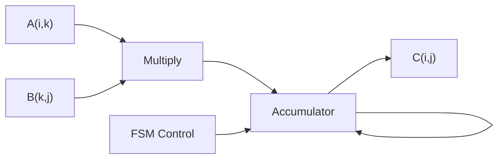
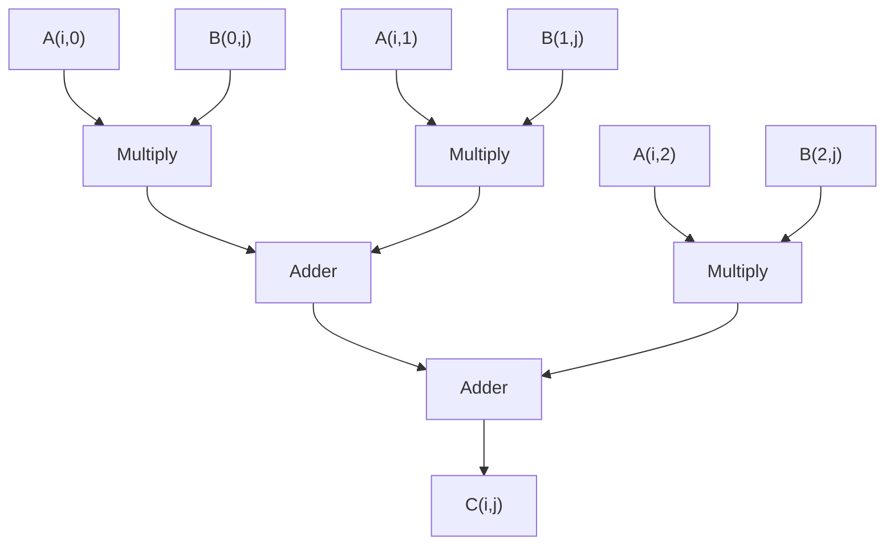
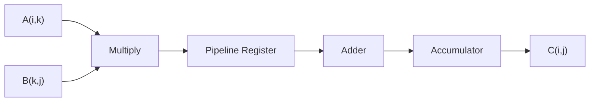

# 🧮 Matrix Multiplier Architectures (VLSI Design)

[]()
[]()
[]()

> 🚀 Comparative analysis of Serial, Parallel, and Pipelined Matrix Multipliers using Verilog HDL

---

## 📋 Project Overview

This project implements and compares three fundamental VLSI architectures for matrix multiplication:

- 🔁 Serial Architecture  
- ⚡ Parallel Architecture  
- 🚀 Pipelined Architecture  

### ✨ Highlights
- 📊 Area, Power, Timing comparison  
- ⚡ Synthesized using Cadence Genus  
- 🧱 Layout using Innovus  
- 📈 Scalable (2×2, 3×3, 4×4)

---

## 🧠 Theory

Matrix multiplication:

C[i][j] = Σ (A[i][k] × B[k][j])

- Requires N³ operations  
- Implemented differently in hardware for optimization  

---

## 🎞️ Architecture Flowcharts

### 🔁 Serial Architecture


### ⚡ Parallel Architecture


### 🚀 Pipelined Architecture


---

## 🧠 Detailed Architecture Explanation

### 🔁 Serial
- Single MAC unit reused  
- FSM controls computation  
- Computes one element at a time  
- ✔ Low area  
- ❌ High latency  

### ⚡ Parallel
- All multipliers active simultaneously  
- Uses adder tree  
- ✔ Fastest  
- ❌ High area & power  

### 🚀 Pipelined
- Uses registers between stages  
- Overlaps operations  
- ✔ Balanced design  
- ✔ Improved timing  

---

## 📊 Architecture Comparison

| Parameter | Serial | Parallel | Pipelined |
|----------|--------|----------|------------|
| Multipliers | 1 | N³ | N² |
| Latency | N³ + N² | 1 | N |
| Area | Low | High | Medium |
| Power | Low | High | Medium |

---

## 🧩 Architecture Diagrams

### 🔁 Serial Architecture Diagram


### ⚡ Parallel Architecture Diagram


### 🚀 Pipelined Architecture Diagram


### 🧠 FSM Control Diagram


---

## 📊 Performance Analysis

### 📈 Area Comparison Plot


### ⚡ Power Comparison Plot


### ⏱️ Timing (Slack) Plot


---

## 📊 Numerical Results

### 📐 Area

| Architecture | 2×2 | 3×3 | 4×4 |
|-------------|-----|-----|-----|
| Serial | 1780 | 3126 | 4787 |
| Pipelined | 3854 | 9024 | 16055 |
| Parallel | 3083 | 10218 | 23453 |

---

### ⚡ Power

| Architecture | 2×2 | 3×3 | 4×4 |
|-------------|-----|-----|-----|
| Serial | 418 | 769 | 1164 |
| Pipelined | 758 | 2233 | 3122 |
| Parallel | 528 | 1521 | 3119 |

---

### ⏱️ Timing

- All designs meet timing constraints  
- Best: Pipelined  
- Worst: Serial (large N)  

---

## 🛠️ Tools Used

- Verilog HDL  
- Cadence Genus  
- Cadence Innovus  
- NC Launch  

---

## 📁 Project Structure

```
matrix-multiplier-vlsi/
├── serial.v
├── parallel.v
├── pipelined.v
├── docs/
└── README.md
```

---

## 🎯 Applications

- AI accelerators  
- DSP systems  
- Image processing  
- Scientific computing  

---

## 💡 Key Insights

✔ Serial → Low resource usage  
✔ Parallel → Maximum speed  
✔ Pipelined → Best trade-off  

---

## 👨‍💻 Authors

- Siddhant Singh  
- Sai Akhilash  
- Anshika Gupta  
- Laveesh M Suvarna  

---

## ⭐ If you like this project

Give it a ⭐ on GitHub!

